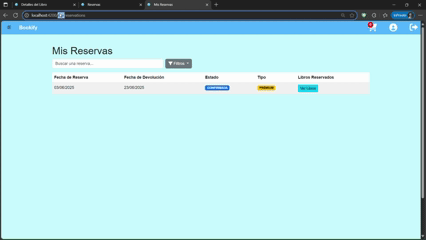

# 🎨 Bookify - Frontend

**Bookify Frontend** es la interfaz de usuario del servicio **Bookify**, donde los usuarios pueden buscar, conocer y reservar libros de manera intuitiva y atractiva. El frontend está construido con **Angular** y está completamente **componentizado** para una fácil gestión y mantenimiento.

---

## 🚀 Descripción general

Bookify Frontend permite a los usuarios interactuar con el sistema de reservas de libros de manera sencilla y rápida. Está diseñado para ser **responsive**, es decir, completamente funcional en dispositivos móviles, y se integra perfectamente con el **backend** para ofrecer una experiencia de usuario fluida y segura.

---

## 🧩 Características principales

- 📱 **Responsive**: Interfaz completamente adaptativa para dispositivos móviles.
- 🖥️ **Angular**: Utiliza Angular como framework para crear una experiencia web interactiva.
- 🛡️ **Guards**: Protege rutas y componentes según el rol del usuario (administrador o usuario regular).
- 🔒 **Autenticación segura**: Acceso a la aplicación mediante autenticación básica, con protección de rutas.
- 📊 **Gráficos interactivos**: Integración con **Charts JS** para mostrar gráficos y estadísticas dinámicas.
- 💅 **Bootstrap**: Estilos modernos y una interfaz intuitiva gracias a **Bootstrap**.
- 🧑‍💼 **Componentización**: El frontend está dividido en componentes reutilizables para facilitar su mantenimiento y escalabilidad.

---

## 🛠️ Tecnologías utilizadas

- **Angular**: Framework utilizado para la construcción del frontend.
- **Bootstrap**: Biblioteca de CSS para hacer que la UI sea moderna y responsiva.
- **Charts JS**: Librería para mostrar gráficos interactivos y estadísticas.
- **Guards de Angular**: Para proteger las rutas según los roles de los usuarios (admin, usuario regular).
- **API con Swagger**: Conexión con la API backend documentada mediante **Swagger**.

---

## 📱 Capturas de pantalla

### Guards - Vista no Autorizada:

### Página de Responsive Mobile:

### Página de Notificaciones:

---

